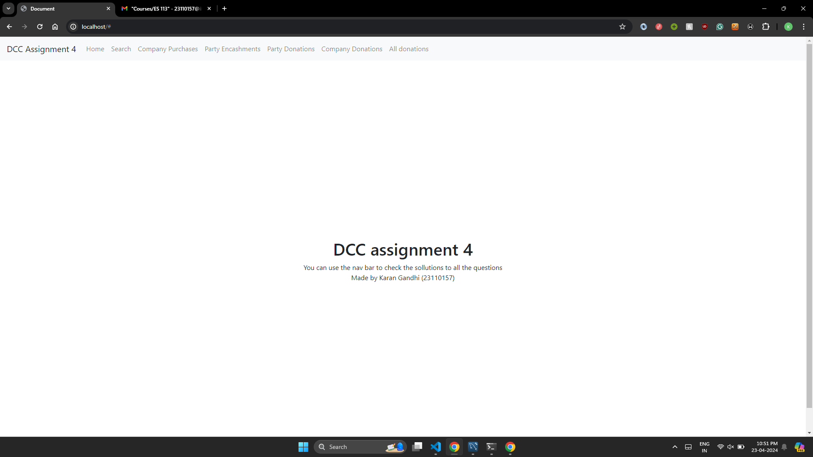
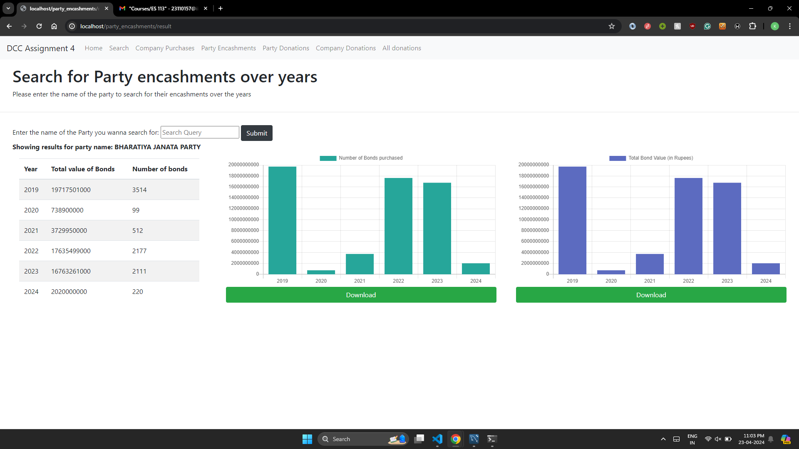
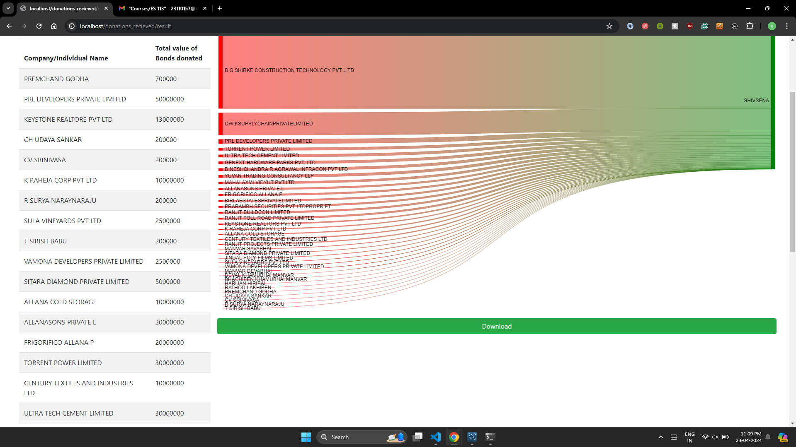

# ES113: Data-centric-computing Assignment 4

This is my submisstion for Assignment 4 of the course: ES 113.

## Running this project.

- First clone this repo.
- First you'll have to install all the python packages that are there in `requirements.txt`
- After that, you'll need to have MySQL and MySQL workbench installed on your computer.
- Once all the packages are installed open MySQL workbench and create a schema named: `dccassignment4`
- After that import the sqldump file into that new schema which you created. The sql dump file is present in `data/sqldump.sql` file.
- Once you have imported the sqldump file, you can run the commands that are there in the `data/assignment.sql` file. This will create a user named "testing" with password "password".
- After that you are ready to run the flask python file: `main.py`. Open command prompt and run the following command:

```
python main.py
```

- After this, open your browser and type localhost in your adressbar. You should see the app running.

## Downloading and loading the dataset - Question 1A and 1B

For converting a pdf file to csv, I wrote a script `data/export.py` that will convert the pdf to csv. You can open the file and modify the filename to that of the pdf and it will output the csv file which you can pipe in a file. For example:

```
python export.py > output.csv
```

I have already converted the pdf to 2 csv files: `purchased.csv` and `encashed.csv`.

After that you can simply create a new schema in your mysql workbench and import these file into that schema. After that you should run the commands that are present in `data/assignment.sql`.

## The Web design - Questions 1C, 1D, 1E, 1F and 2A

Once the app is running the home page will look like the following.



### Question 1

Implement a robust search functionality that allows users to quickly search for specific records based on Bond Number or filter data based on any column in the table except Sr. No. and Status (e.g., date, political party, company name). The output should be displayed in the form of a table which is fetched from the database for a given query.


### Question 2

The option to select a Company/Individual from a drop-down/search, and show how many bonds and the total value of bonds purchased per year. You can present a bar plot depicting your results.


### Question 3

The option to select a political party from a drop-down/search, and show how many bonds and total value per year are in the timeline. You can present a bar plot depicting your results.




### Question 4 and Plots (a) (ii)

The option to select a political party from a drop-down/search, shows which companies have donated to it and what amount individually and combined.




### Question 5 and Plots (a) (ii)

Similarly, provide an option to select a company from a
drop-down/search, showcasing which parties they have donated and what amount individually and combined.


### Question 6

Apart from 1e4 and 1e5, you can also display the Pie chart depicting the total amount of donations to all the parties.


## Questions 2, 3 and 4

I done these questions and included the screenshots above.

For questions 4, I created this repo and added this `README.md` file.
